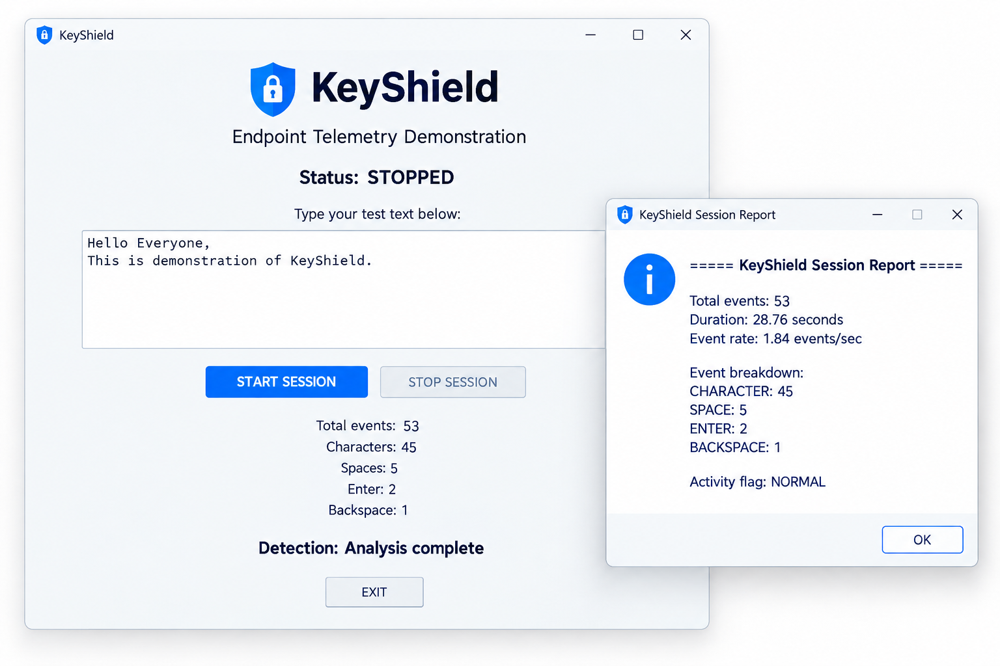

# KeyShield

A small Python-based endpoint telemetry demonstration for cybersecurity education.

## Overview

KeyShield demonstrates a simplified blue-team workflow:

Telemetry → Analysis → Detection → Reporting

The application records keyboard event types from a controlled text box and generates basic session statistics.

It does not store the actual characters typed.

## Features

- Controlled keyboard-event monitoring
- Start/Stop session controls
- Privacy-preserving event logging
- CSV session storage
- Session statistics
- Event-rate analysis
- Basic rule-based activity detection
- Session report generation
- Simple graphical interface

## Demo

## Detection Logic

KeyShield currently uses a simple rule-based threshold.

Event rate greater than 8 events/second:

HIGH EVENT RATE

Otherwise:

NORMAL

This is intentionally simple and is meant to demonstrate the concept of detection logic rather than provide a production security detector.

## Project Structure

KeyShield/
├── src/
│   └── main.py
├── sessions/
│   └── .gitkeep
├── screenshots/
├── .gitignore
├── README.md
└── requirements.txt

## Installation

Create a virtual environment:

python -m venv .virtual

Activate it on Windows:

.\.virtual\Scripts\Activate.ps1

Install dependencies:

pip install -r requirements.txt

Run KeyShield:

python src/main.py

## Usage

1. Start the application.
2. Click START SESSION.
3. Enter test text in the provided text box.
4. Click STOP SESSION.
5. Review the generated session report.
6. Check the sessions directory for the CSV telemetry file.

## Privacy and Safety

KeyShield is designed for authorized cybersecurity demonstrations.

It:

- monitors only its own controlled text box
- records event types rather than typed content
- does not capture passwords
- does not monitor other applications
- does not use stealth mechanisms
- does not establish persistence
- does not transmit collected data

Only use the project with input you are authorized to monitor.

## Future Improvements

Possible future development:

- richer telemetry visualization
- additional endpoint telemetry
- improved detection rules
- anomaly detection
- machine-learning-based analysis
- detection dashboards